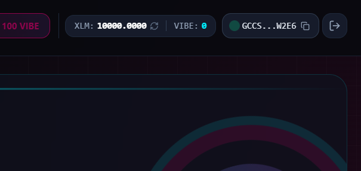
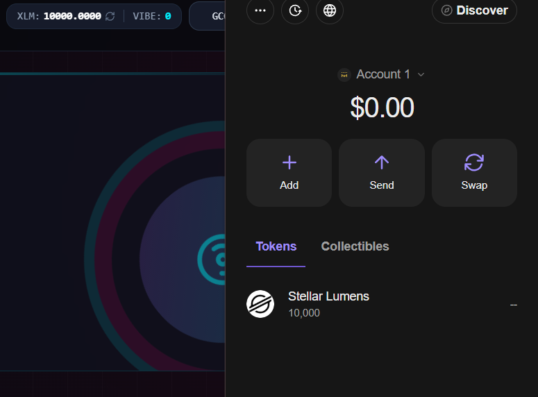
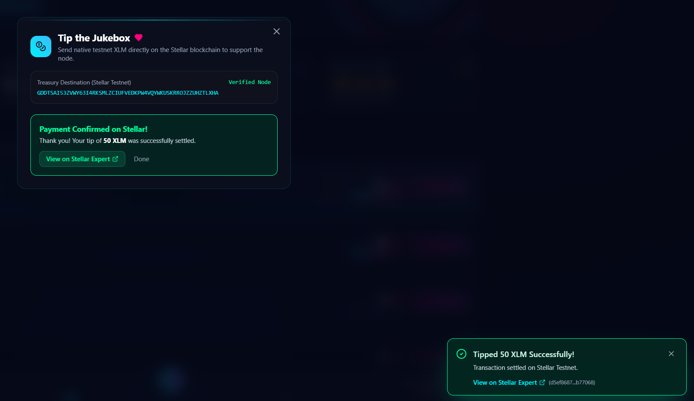
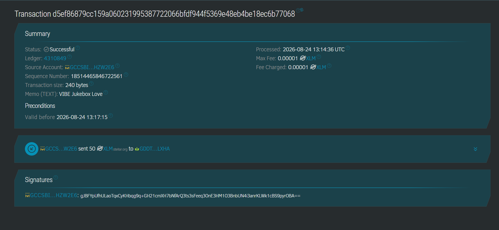
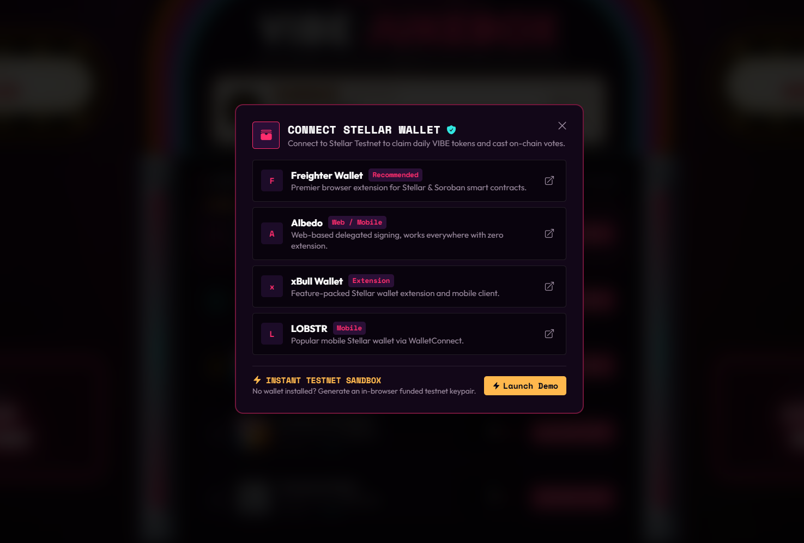
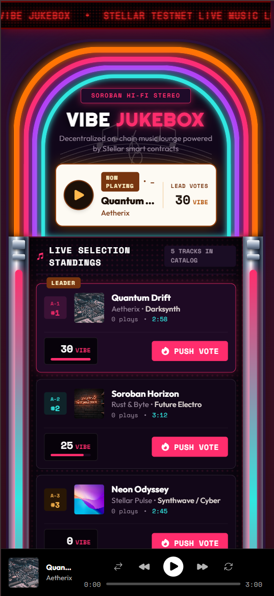
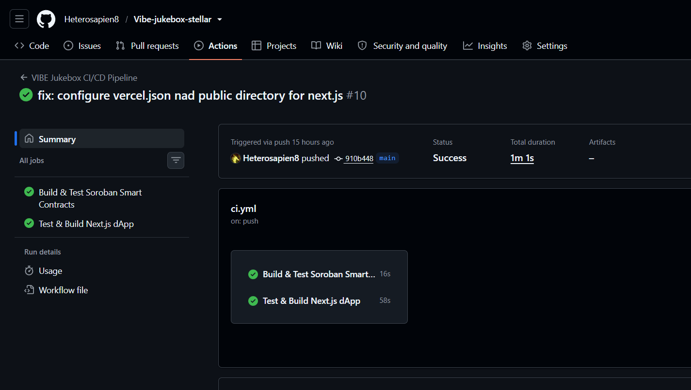
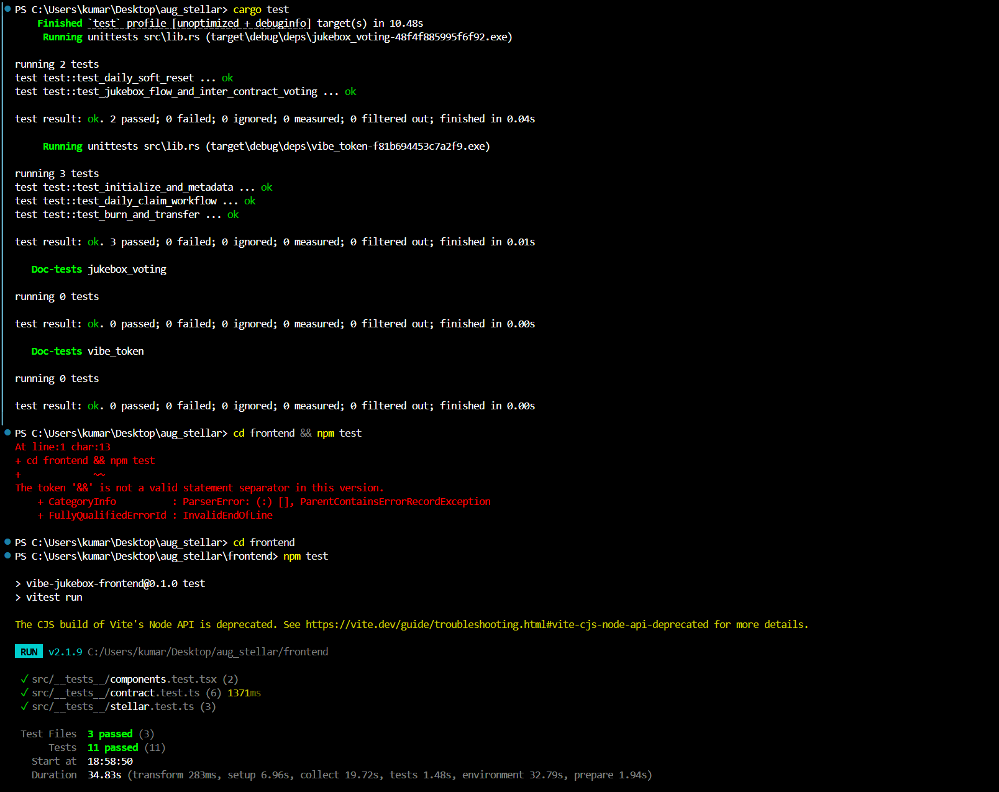

# VIBE Jukebox — Token-Curated Jukebox on Stellar & Soroban

[](https://github.com/Heterosapien8/aug_stellar/actions/workflows/ci.yml)
[](https://stellar.org)
[](https://soroban.stellar.org)
[](https://nextjs.org)

**Rise In — Stellar Bootcamp Bounty Submission**  
Built by **Divyanshu Kumar** 

---

## Overview

**VIBE Jukebox** is a decentralized, token-curated music lounge application deployed on the **Stellar Testnet** and powered by **Soroban smart contracts**.

Users connect their Stellar wallet, claim free daily **VIBE testnet tokens** directly on-chain, tip the jukebox node in **native XLM**, and spend variable amounts of VIBE to upvote and re-rank songs in a live shared music queue. Spent tokens are automatically burned on-chain via cross-contract calls between `jukebox-voting` and `vibe-token`.

---

## Belt Milestones Satisfied

### Level 1 (White Belt)
### Screenshots

**Wallet connected**


**Balance displayed**


**Successful testnet transaction**


**Transaction result shown**


### Level 2 (Yellow Belt)
- **3 Error Types Handled**: Insufficient VIBE balance, rate-limited 24h daily claims, unauthorized song registrations, unfunded testnet account (404), and wallet signature rejection.
- **Contract Deployed on Testnet**: VIBE Token (`CD76SQMY...`) & Jukebox Voting (`CAVVNHZ3...`).
- **Contract Called from Frontend**: Direct invocations for daily claim minting, variable token burning, and on-chain track creation.
- **Transaction Status Visible**: Step-by-step transaction indicator (preparing, signing, submitting, confirmed) with live Stellar Expert explorer links.
- **Multi-Wallet App**: Native support for Freighter, Albedo, xBull, LOBSTR, and an instant browser-funded Testnet sandbox.
#### Screenshots

**Wallet Options Available**  

---


### Level 3 (Orange Belt)
- **Inter-Contract Communication**: `jukebox-voting` contract initiates cross-contract calls into `vibe-token` via `VibeTokenClient` to burn tokens during song upvoting.
- **Event Streaming & Real-Time Updates**: Soroban contract events (`votecast`, `song_add`, `claim`, `burn`, `reset`) emitted and polled by the frontend queue.
- **CI/CD Pipeline**: Automated GitHub Actions workflow testing Soroban Rust WASM contracts and Next.js builds on every push/PR.
- **Mobile Responsive Frontend**: Fully responsive glassmorphism UI optimized for mobile, tablet, and desktop screens.
- **Contract & Frontend Testing**: 5 unit tests for Soroban contracts + 11 Vitest tests for frontend helpers and components.
- **Demo Video**: [Watch the 2-Minute Walkthrough Video](YOUR_LOOM_OR_YOUTUBE_LINK_HERE)
- **Live Demo**: [https://vibe-jukebox-stellar.vercel.app](YOUR_VERCEL_OR_NETLIFY_LINK_HERE)
- 
#### Screenshots

**Mobile Responsive UI**  


**CI/CD Pipeline Passing**  


**Test Suite (16 Passing Tests: 5 Soroban + 11 Frontend)**  



---

## Verified Stellar Testnet Deployments & Invocations

| Parameter | Value / Link |
|---|---|
| **Network** | Stellar Testnet (`Test SDF Network ; September 2015`) |
| **Horizon RPC** | `https://horizon-testnet.stellar.org` |
| **Soroban RPC** | `https://soroban-testnet.stellar.org` |
| **VIBE Token Contract ID** | [`CD76SQMY64AT4AKTV6VHRF7MMHLC3JPQZ2W4TS57CS4VWE22E4A7G7K6`](https://stellar.expert/explorer/testnet/contract/CD76SQMY64AT4AKTV6VHRF7MMHLC3JPQZ2W4TS57CS4VWE22E4A7G7K6) |
| **Jukebox Voting Contract ID** | [`CAVVNHZ3JH7M4MHFYVNKTR6BX6VLOUEG7R4DLEAWB26AXIVCMJBBB2QT`](https://stellar.expert/explorer/testnet/contract/CAVVNHZ3JH7M4MHFYVNKTR6BX6VLOUEG7R4DLEAWB26AXIVCMJBBB2QT) |
| **Contract Deploy Tx (Token)** | [`01d4fffc280307e23721150246a8e989d3981bab29baee4998f7b3f41093c9ea`](https://stellar.expert/explorer/testnet/tx/01d4fffc280307e23721150246a8e989d3981bab29baee4998f7b3f41093c9ea) |
| **Contract Deploy Tx (Voting)** | [`270ef446cb0b8180d17077d0ca5d752b7ba945c6bf72fe1c3c2cdbbe8f2ebc29`](https://stellar.expert/explorer/testnet/tx/270ef446cb0b8180d17077d0ca5d752b7ba945c6bf72fe1c3c2cdbbe8f2ebc29) |
| **Verified Inter-Contract Vote Tx** | [`13a55ffb22c428d9563bd92b14065b2cb4e63681943ffe57ef22b50fb50b755b`](https://stellar.expert/explorer/testnet/tx/13a55ffb22c428d9563bd92b14065b2cb4e63681943ffe57ef22b50fb50b755b) |
| **Verified Daily Claim Tx** | [`eb33d9d478f0b636291f8c7b484277e625930f9ea8791666bbd107ec78145ebc`](https://stellar.expert/explorer/testnet/tx/eb33d9d478f0b636291f8c7b484277e625930f9ea8791666bbd107ec78145ebc) |
| **Verified Add Song Tx** | [`01cd506288a904949126056c324d330a5948a5a0a04a1a3380ee04cd9265422d`](https://stellar.expert/explorer/testnet/tx/01cd506288a904949126056c324d330a5948a5a0a04a1a3380ee04cd9265422d) |

---

## Project Architecture

```
aug_stellar/
├── contracts/
│   ├── vibe-token/              # Soroban Rust Contract: VIBE Token
│   │   ├── Cargo.toml
│   │   └── src/
│   │       ├── lib.rs           # Token contract logic (claim_daily, burn, mint)
│   │       └── test.rs          # Rust unit tests
│   └── jukebox-voting/          # Soroban Rust Contract: Jukebox Voting
│       ├── Cargo.toml
│       └── src/
│           ├── lib.rs           # Inter-contract burn calls, soft reset, queue
│           └── test.rs          # Inter-contract unit tests
├── frontend/                    # Next.js 14 (App Router) + TypeScript
│   ├── src/
│   │   ├── app/                 # Root layout, globals.css, main jukebox page
│   │   ├── components/          # UI components (Navbar, TipModal, SongQueue, AudioVisualizer, Toast)
│   │   ├── lib/                 # Soroban RPC client, Horizon client, WalletsKit, Web Audio SFX
│   │   ├── types/               # TypeScript interfaces
│   │   └── __tests__/           # Vitest & React Testing Library test suite
│   ├── .env.local               # Deployed contract IDs & endpoints
│   ├── .env.example             # Environment template
│   ├── package.json
│   ├── tailwind.config.ts
│   └── vitest.config.ts
├── .github/workflows/ci.yml     # Automated CI/CD build & test pipeline
├── Cargo.toml                   # Root Cargo workspace
├── PROJECT.md                   # Architecture & design specifications
├── REQUIREMENTS.md              # Live checklist tracker
└── README.md                    # This documentation file
```

---

## Quick Start Guide

### Prerequisites
- [Node.js](https://nodejs.org) (v18+ or v20+)
- [Rust & Cargo](https://rustup.rs) (with `wasm32-unknown-unknown` / `wasm32v1-none` target)
- [Stellar / Soroban CLI](https://developers.stellar.org/docs/tools/developer-tools/cli/stellar-cli) (`stellar` / `soroban`)
- [Freighter Wallet Extension](https://freighter.app) (optional: built-in demo sandbox included)

### 1. Clone & Setup
```bash
git clone https://github.com/Heterosapien8/aug_stellar.git
cd aug_stellar
```

### 2. Test Smart Contracts (Rust)
```bash
cargo test
```
*Runs all unit tests for token minting, rate-limited daily claims, inter-contract burns, and daily soft resets.*

### 3. Build & Deploy Smart Contracts (Optional — already live on testnet)
```bash
# Build WASM binaries
stellar contract build

# Deploy VIBE token contract
stellar contract deploy --wasm target/wasm32v1-none/release/vibe_token.wasm --source <identity> --network testnet

# Deploy Jukebox voting contract
stellar contract deploy --wasm target/wasm32v1-none/release/jukebox_voting.wasm --source <identity> --network testnet
```

### 4. Run Frontend Tests
```bash
cd frontend
npm install --legacy-peer-deps
npm test
```

### 5. Start Local Development Server
```bash
cd frontend
npm run dev
```
Open [http://localhost:3000](http://localhost:3000) in your browser.

---

## Testing Verification

### Smart Contracts (Rust)
```
running 3 tests in vibe-token:
test test::test_initialize_and_metadata ... ok
test test::test_daily_claim_workflow ... ok
test test::test_burn_and_transfer ... ok

running 2 tests in jukebox-voting:
test test::test_daily_soft_reset ... ok
test test::test_jukebox_flow_and_inter_contract_voting ... ok

test result: ok. 5 passed; 0 failed
```

### Frontend (Vitest)
```
 ✓ src/__tests__/contract.test.ts (6 tests)
 ✓ src/__tests__/stellar.test.ts (3 tests)
 ✓ src/__tests__/components.test.tsx (2 tests)

Test Files  3 passed (3)
Tests       11 passed (11)
```

---

## License
MIT License. Built for the Rise In Stellar Bootcamp Bounty.
